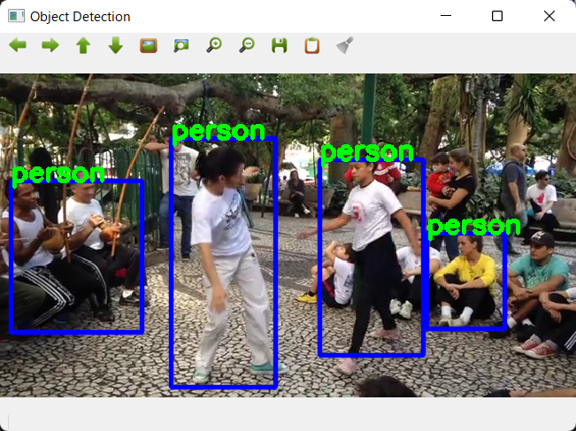

# zig-tflite-example

Example app using [zigcv](https://github.com/ryoppippi/zigcv) and [zig-tflite](https://github.com/mattn/zig-tflite).



## Usage

```
$ ./zig-out/bin/zig-tflite-example
```

## Requirements

* OpenCV SDK
* TensorFlow Lite

## Installation

```
$ git submodule update --init
$ zig build
```

## License

MIT

## Author

Yasuhiro Matsumoto (a.k.a. mattn)
